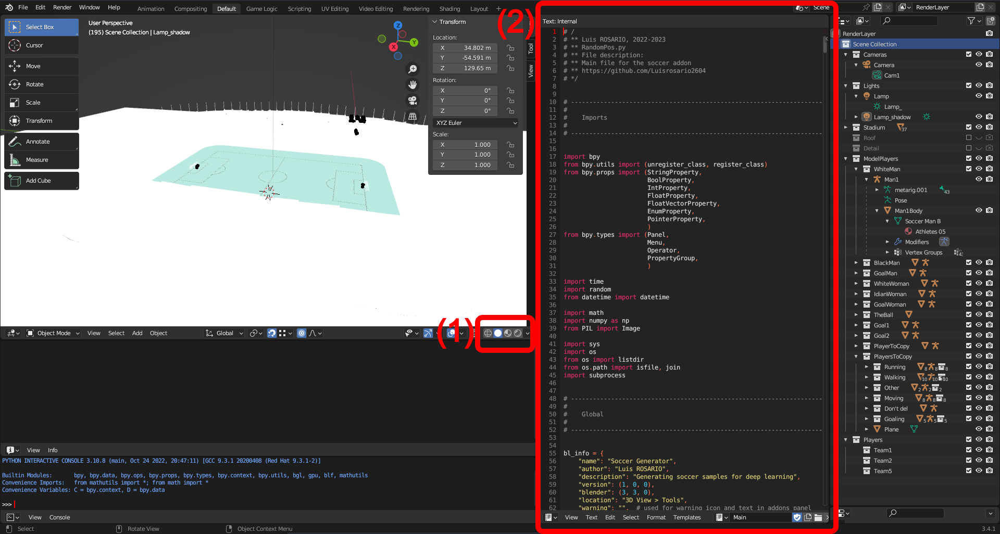
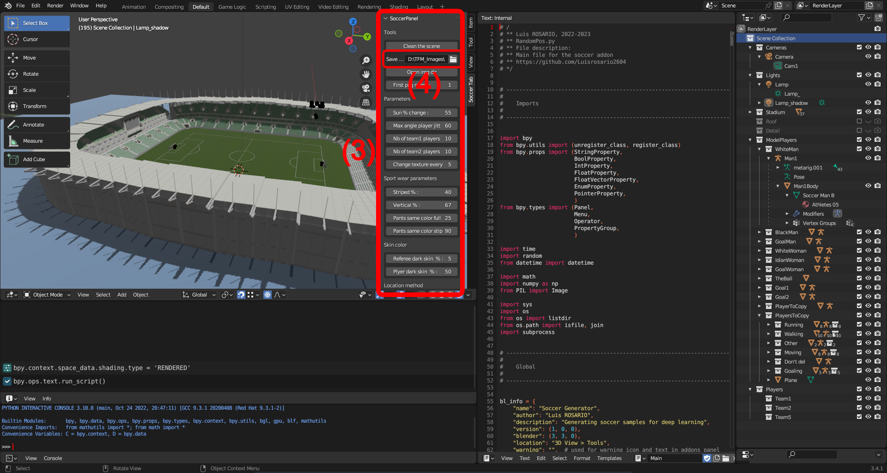
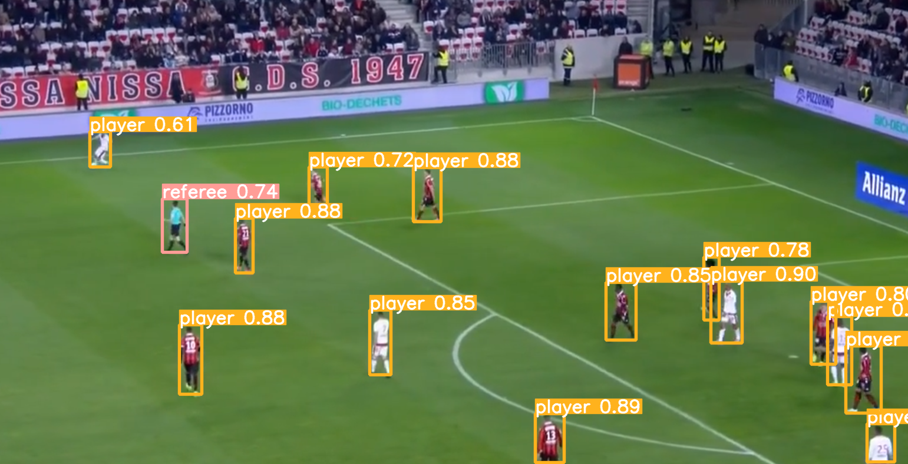

# Object-detection-soccer-synthetic-data

Object detection for soccer trained with synthetic images (Blender)

#### 👨‍🎓 This project was carried out during my master's degree in computer vision at URJC - Madrid

## Summary

This project is the result of my master thesis.
This project presents an object detection model for soccer situations.
The model has been only trained with synthetic images created with Blender.
The model has been trained via transfer learning with YoloV8.

This project is divided in 2 big sections: the generation of the synthetic data and the model.

The goal of this readme is to explain how to install and use the project.

###### More explanations in ```Docs/TFM_Luis_ROSARIO_TREMOULET.pdf``` (only in spanish)

## Goals

- Generate (customizable) synthetic data with Blender
- Create an object detection model for soccer situations

## Requirements

### Softwares

* Blender
* Python 3.7+
* Jupyter notebook
* Conda (if you need GPU and you are on Windows)

### Python packages

* numpy >= 1.21.3
* Pillow >= 9.5.0
* opencv_python >= 4.7.0.72
* tqdm >= 4.63.1
* ultralytics >= 8.0.71
* bpy >= 3.5.0

```bash
$ pip install -r requirements.txt

                or
                
$ pip3 install -r requirements.txt
```

## Usage (Blender)

###### Go to ```Object-detection-soccer-synthetic-data/Blender/```

Open ```[Soccer Arena] Win & Linux.blend``` in Blender.

<p align="center">
  
</p>
<p align="center">
  <i>Blender project should like this</i>
</p>

1) Click on the viewport section ```(1)``` if you want to change the scene view (not required)

2) Click on the code section ```(2)``` and press ```ALT + P``` to add the add-on to Blender.

<p align="center">
  
</p>
<p align="center">
  <i>The soccer panel should have appeared (3)</i>
</p>

3Locate the ```Soccer_saves/``` folder in the soccer panel ```(4)```.

4You can start to use the add-on (scroll on the add-on to view all options).

## Usage (Use the models already trained)

###### Go to ```Object-detection-soccer-synthetic-data/Model/Already_trained/```

```bash
$ python predict.py -f=[File_path] -m=models/4_classes/weights/best.pt

                        or

$ python predict.py -f=[File_path] -m=models/val_real/weights/best.pt
```

Some files are available in ```data/``` folder

## Usage (Train the model)

###### Go to ```Object-detection-soccer-synthetic-data/Model/To_train/```

### 1) Dataset structure

The dataset need to have this structure :

    .
    └── data
        ├── all_annot
        ├── all_imgs
        └── yolo_training_dataset
            ├── images          # Name and struture required
            │    ├── test       # Name and struture required
            │    ├── train      # Name and struture required
            │    └── val        # Name and struture required
            └── labels          # Name and struture required
                ├── train       # Name and struture required
                └── val         # Name and struture required

Move all your images in ```all_imgs/``` and all your annotations in ```all_annot/```.

### 2) Modify config.yaml

You will need to modify ```config_low_linux_mac.yaml``` or ```config_low_windows.yaml``` paths (lines 3-4-5)
You can modify the class list too in the yaml file.

### 3) Run script

Run ```Model_trainer_custom.ipynb``` script with jupyter notebook and follow the notebook instructions.

```bash
$ jupyter notebook Model_trainer_custom.ipynb
```

## Usage (Other scripts)

###### Go to ```Object-detection-soccer-synthetic-data/Other_Scripts/```

### 1) annotation.py and annotation_low.py

Create the annotations from groundtruth images.
Place the groundtruth images and the program will generate annotations in Yolo format.

```bash
$ python annotation.py -i=[Input_directory] -o=[Output_directory]
```

```bash
$ python annotation_low.py -i=[Input_directory] -o=[Output_directory]
```

The difference between annotation.py and annotation_low.py are the object class numbers (lines 47-72).

### 2) down_resolution.py

If the user wants to downgrade the resolution of the images.

```bash
$ python down_resolution.py -i=[Input_directory] -o=[Output_directory] -r=[Resolution_width]
```

### 3) squares.py

If the user wants to view the result of the annotation on an image.

```bash
$ python squares.py -i=[Input_directory]

                    or

$ python squares.py -i=squares_example_folder
```

The [Input_directory] must have this structure :

    .
    └── [Input_directory]
        ├── ano
        │    └── *.txt
        └── img
            └── *.png

And files ```*.txt ``` / ```*.png``` must have a number name like ```1.txt``` and ```1.png```

Press any key to skip images or exit.

## Examples

<p align="center">
  
</p>
<p align="center">
  <i>Example of 4_classes model</i>
</p>

<p align="center">
  
</p>
<p align="center">
  <i>Example of val_real model</i>
</p>

## Authors

* **Luis Rosario** - *Member 1* - [Luisrosario2604](https://github.com/Luisrosario2604)
