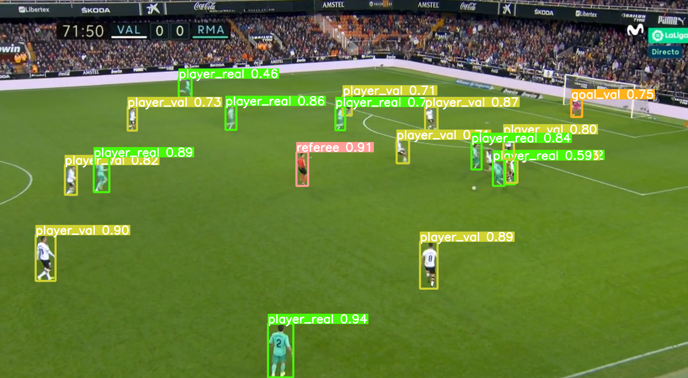

# Object-detection-soccer-synthetic-data

Object detection model for real football scenes, trained only with synthetic data (Blender renderings)

#### 👨‍🎓 This project was carried out during my master's degree in computer vision at URJC - Madrid

## Summary

This project is the result of my master thesis.
This project presents an object detection model for (real) soccer situations.
The model has been only trained with synthetic images created with Blender.
The model has been trained via transfer learning with YoloV8.

This project is divided in 2 big sections: the generation of the synthetic data and the model.

The goal of this readme is to explain how to install and use the project.

###### More explanations in ```Docs/TFM_Luis_ROSARIO_TREMOULET.pdf``` (only in spanish / 70 pages)

## Goals

- Generate (customizable) synthetic data with Blender
- Create an object detection model for soccer situations

## Requirements

### Softwares

* Blender
* Python >=3.7, <=3.10
* Jupyter notebook
* Conda (if you need GPU and you are on Windows)

### Python packages

* jupyter >= 1.0.0
* numpy >= 1.21.3
* Pillow >= 9.3.0
* opencv_python >= 4.8.0.76
* opencv-contrib-python>= 4.8.0.76
* tqdm >= 4.63.1
* ultralytics >= 8.0.71

```bash
$ pip3 install -r requirements.txt
```

## Usage (Blender)

###### Go to ```Object-detection-soccer-synthetic-data/Blender/```

Open ```[Soccer Arena] Win & Linux.blend``` in Blender.

<p align="center">
  
</p>
<p align="center">
  <i>The Blender project should look like this when openned</i>
</p>

1) Click on the viewport section ```(1)``` if you want to change the scene view (not required)

2) Click on the code section ```(2)``` and press ```ALT + P``` to install the Python3 packages (needed!).

3) Click on the code section ```(3)``` (book icon) 

4) Select "F Main" file on the section ```(4)``` (changes the script)

<p align="center">
  
</p>
<p align="center">
  <i>The soccer panel should have appeared (4)</i>
</p>

5) Click on the code section ```(5)``` and press ```ALT + P``` to add the add-on to Blender.

6) Locate the ```Soccer_saves/``` folder in the soccer panel ```(6)```.

7) You can start to use the add-on (scroll on the add-on to view all options).

## Examples of images and groundtruths generated by Blender

<p align="center">
  
</p>
<p align="center">
  <i>9 examples of images and groundtruths generated by Blender</i>
</p>

## Windows users

1) Use powershell instead of cmd.
2) Use full flags names ```--input instead of -i=```

## Usage (Use the models already trained)

###### Go to ```Object-detection-soccer-synthetic-data/Model/Already_trained/```

```bash
$ python predict.py -f=[File_path] -m=models/4_classes/weights/best.pt

                        or

$ python predict.py -f=[File_path] -m=models/val_real/weights/best.pt

Linux example:
-> python predict.py -f=data/Val_Real_1.png -m=models/val_real/weights/best.pt

Windows example:
-> python predict.py --file .\data\Val_Real_1.png --model .\models\val_real\weights\best.pt
```

```4_classes``` model (4 classes) : Model for all matches (cannot differentiate between 2 players from different teams)

```val_real``` model (5 classes) : Specific model trained for Valencia C.F versus Madrid C.F matches (can make the difference between 2 players from different teams)

Some files are available in ```data/``` folder

## Usage (Train the model)

###### Go to ```Object-detection-soccer-synthetic-data/Model/To_train/```

### 1) Dataset structure

The dataset need to have this structure :

    .
    └── data
        ├── all_annot
        ├── all_imgs
        └── yolo_training_dataset
            ├── images          # Name and struture required
            │    ├── test       # Name and struture required
            │    ├── train      # Name and struture required
            │    └── val        # Name and struture required
            └── labels          # Name and struture required
                ├── train       # Name and struture required
                └── val         # Name and struture required

Move all your images in ```all_imgs/``` and all your annotations in ```all_annot/```.

### 2) Modify config.yaml

You will need to modify ```config_low_linux_mac.yaml``` or ```config_low_windows.yaml``` paths (lines 3-4-5)
You can modify the class list too (in the yaml file).

### 3) Run script

Run ```Model_trainer_custom.ipynb``` script with jupyter notebook and follow the notebook instructions.

```bash
$ jupyter notebook Model_trainer_custom.ipynb
```

## Usage (Other scripts)

###### Go to ```Object-detection-soccer-synthetic-data/Other_Scripts/```

### 1) annotation.py and annotation_low.py

Creation of the annotations from groundtruth images.
Place the groundtruth images on a folder ```[Input_directory]``` and the program will generate their annotations in the Yolo format.

```bash
$ python annotation.py -i=[Input_directory] -o=[Output_directory]

Linux example:
-> python annotation.py -i=render_examples/groundtruth -o=result

Windows example:
-> python annotation.py --input .\render_examples\groundtruth\ --output .\results
```

```bash
$ python annotation_low.py -i=[Input_directory] -o=[Output_directory]

Linux example:
-> python annotation_low.py -i=render_examples/groundtruth -o=result

Windows example:
-> python annotation_low.py --input .\render_examples\groundtruth\ --output .\results
```

The difference between annotation.py and annotation_low.py are the number of objects classes (lines 47-72).

### 2) down_resolution.py

If the user wants to downgrade the resolution of the images.

```bash
$ python down_resolution.py -i=[Input_directory] -o=[Output_directory] -r=[Resolution_width]

Linux example:
-> python down_resolution.py -i=render_examples/render -o=result -r=320

Windows example:
-> python down_resolution.py --input .\render_examples\render\ --output .\results --res 320
```

### 3) squares.py

If the user wants to view the result of the annotation on an image.

```bash
$ python squares.py -i=[Input_directory]

Linux example:
-> python squares.py -i=squares_example_folder

Windows example:
-> python squares.py --input .\squares_example_folder\
```

The [Input_directory] must have this structure :

    .
    └── [Input_directory]
        ├── ano
        │    └── *.txt
        └── img
            └── *.png

And files ```*.txt ``` / ```*.png``` must have a number name like ```1.txt``` and ```1.png```

Press any key to skip images or exit.

## Examples

<p align="center">
  
</p>
<p align="center">
  <i>Example of 4_classes model detection</i>
</p>

<p align="center">
  
</p>
<p align="center">
  <i>Example of val_real model detection</i>
</p>

## Authors

* **Luis Rosario** - *Member 1* - [Luisrosario2604](https://github.com/Luisrosario2604)
